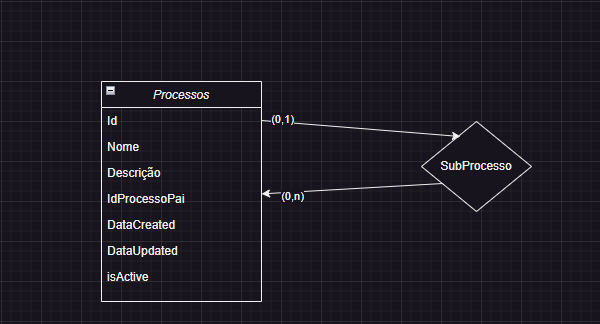

# MapaProcessos

É um projeto desenvolvido com o .NET 7 e Angular 17.

## Back-End

Foi desenvolvido com .NET 7, utilizando o Clean Architecture, que enfatiza a separação em partes do desenvolvimento do sistema, deixando ele mas facil de realizar teste e realizar manuntenção no codigo, além de outros beneficios. Foram utilizados tambem os Design Patters Repository Pattern e Dependency Injection para um melhor segregação das reposabilidades do sistema. Com conexão ao banco de dados SQL Server.

### Proximos passos do Banck-End

- Implementar filtro de Exceções, para deixar a aplicação com respostar pradonizadas e mapeadas, para ser feita a utilização correta da api;
- Criar testes unitarios para toda a aplicação, além de teste e2e para teste do fluxo completo;
- Implementar Logs para cada etapada da aplicação, para um melhor monitoramento e analise de problemas;
- Utilizar mais praticas de segurança, implementando uma autenticação entre a aplicação front-end e back-end;

## Front-End

Foi desenvolvido em Angular 17, utilizando os packages de design do bootstrap 5.3 e do angular/materials.

### Proximos passos do Front-End

- Implentar todas as funcionalidades disponibilizada pela API, como: Atualização dos processos, visualização em detalhes de um processo, atualização do processo pai.
- Implementar mais recursos na tela principal, como inclusão das descrições de cada processo e subprecesso;
- Implementar os testes unitarios de cada component e service;
- Teste e2e para a aplicação;

## Diagrama de Entidade e Relacionamento

